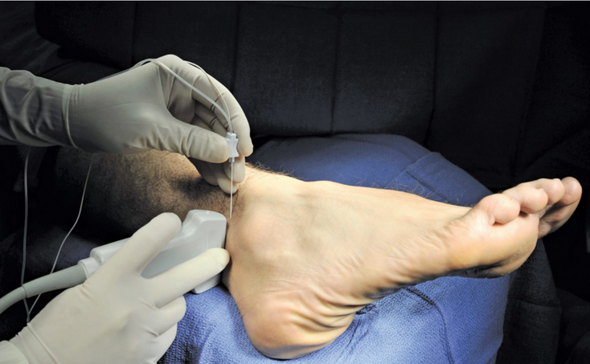

- criei 2 pessoas teste
	- [[pessoa/carlos abc]]
	- [[pessoa/maria xpto]]
- {{query (and (namespace [[pessoa]]) (page-property :tipo "medico"))}}
  query-table:: true
  query-properties:: [:tipo :alias :created-at :updated-at]
- Qual é o nervo que está a ser bloqueado nesta imagem?   #card #nerve-block
	- É o [[nervo sural]]
		- ver [[bloqueio do nervo sural]]
	- Para aprender
		- qual é o maléolo que está na imagem?
-